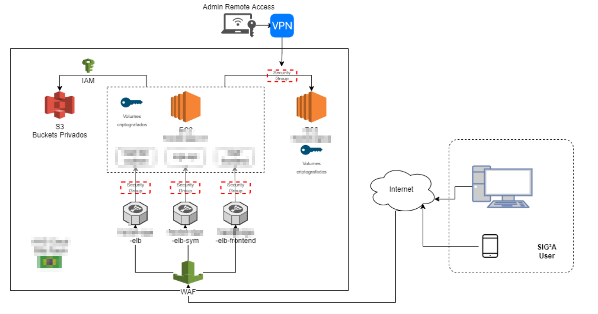

  
  <h1>Gustavo Hattenhauer Gomes</h1>

  Florianópolis/Brazil

## Summary
Software Developer and Oceanographer. Currently I work as technology and systems manager, leading a team of 17 people and developing systems to hydrological and mateorological applications. 

I have experience with web programming, mobile development, Linux administration, relational databases, data analysis, statistics, time series manipulation, matrix and specialized data manipulation, and geoprocessing.

Good communication, teamwork, problem solving instinct, proactive and determined. My biggest motivation is to encounter complex challenges. Those in which it is necessary to understand the process and know the variables to solve the problem. Nothing is impossible, because for everything there is a way to do it. 

I pass my last seven years working on a hydrological complex project with four core parts: rain data assimilation, numerical modelling, data delivery, and web tools to interpretate and analyse model results. See my work experiences to best understand this project. 

I'm currently looking for a Data Engineer or Web Developer position, where I think I'll have my best performance.

## Recent Technical Avaliation

2022-Abr: Technical test's passed successful on Turing platform:
- Javascript
- Python
- Matlab
- SQL
- Docker
- AWS
- AWS Lambda

# Work History

### Technology and Systems Manager
June-2019 - Present
Technology and System Manager, working with an amazing team developing web and mobile system for Dam Safety and Hydrological Monitoring and Forecasting, leading 17 people team, creating processes, and so on.

#### AWS Migration - Recent Project
https://siga.fractaleng.com.br

Web system migration from Linode cloud to AWS cloud. A customer and your TI team have analyzed the system and has suggests several improvements, either cybersecurity as infrastruct. After our analyse, we decide that the best choice was to migrate to AWS cloud and setup AWS services to specific purposes.

We worked is six different areas:
- User authentication and data security improvements. The solution was integrate an authentication system that comprised: multi-factor authentication, password policy, password change after perior, account lockout after attempts;
- Periodic vulnerability assesment to find weakness and flaws on system;
- Traffic inspection and web application firewall (WAF);
- Proper isolation of application (web server, database, app server);
- Data-at-rest encryptation to protect customer data;
- Business Continuity and Disaster Recovery Plan to minimize downtime in case of failure.

Currently this project has been completed and is in production. All services are working properly.

  

